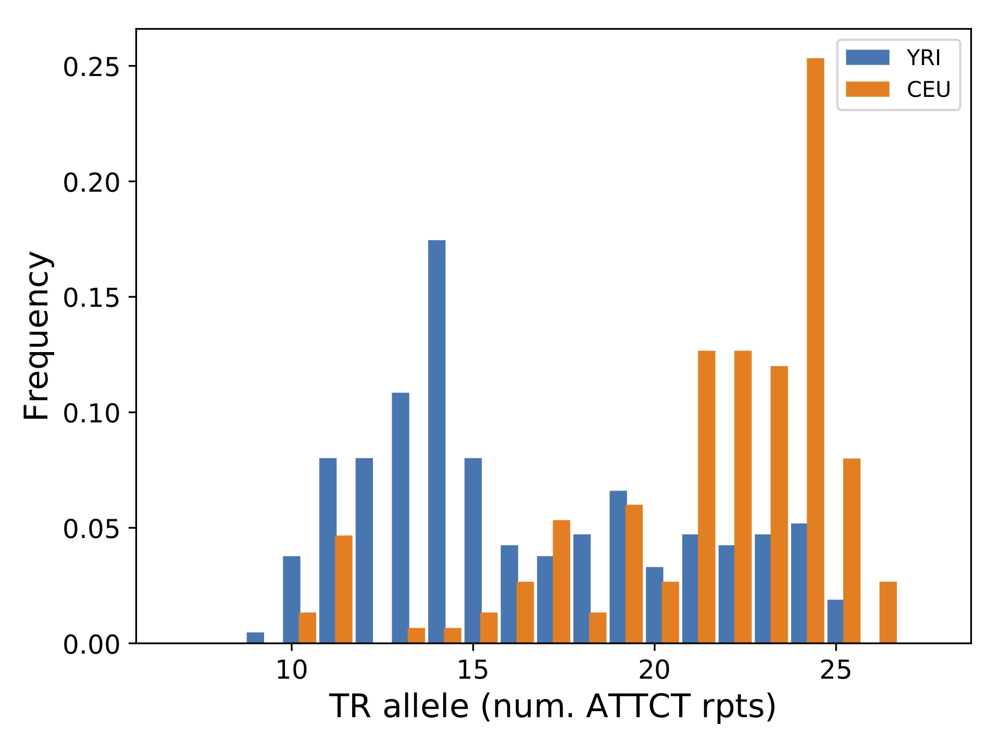
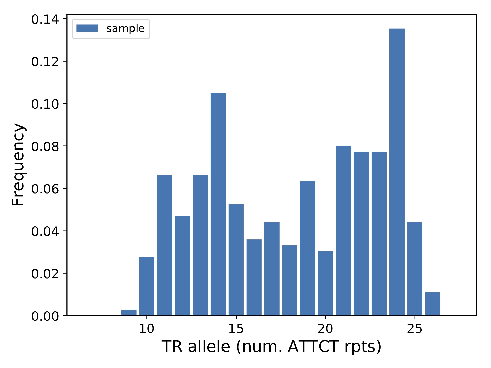

Plotting allele length distributions by population group
========================================================

Tools used: mergeSTR, statSTR

This vignette shows how to use :code:`mergeSTR` to merge two VCF files and :code:`statSTR` to plot allele frequencies across different sample groups for an example TR locus. It uses the example VCF files :code:`ceu_ex.vcf.gz` and :code:`yri_ex.vcf.gz` available at https://github.com/gymrek-lab/TRTools/tree/master/example-files. These VCFs were generated by GangSTR on samples sequenced by the 1000 Genomes Project. They have already been sorted and indexed.

After downloading the VCF files, we can use :code:`mergeSTR` to merge them into a single VCF::

	mergeSTR --vcfs ceu_ex.vcf.gz,yri_ex.vcf.gz --out merged

This will create the output :code:`merged.vcf`. We should zip and index the file::

	bgzip merged.vcf
	tabix -p vcf merged.vcf.gz

Now, we can use :code:`statSTR` to compute or plot statistics for one or more TR loci across all samples or one or more subsets of samples in the file. Below, we show an example plotting the distribution of allele lengths in CEU and YRI populations separately for a single TR::

	# Get the CEU and YRI sample lists
	bcftools query -l yri_ex.vcf.gz > yri_samples.txt
	bcftools query -l ceu_ex.vcf.gz > ceu_samples.txt

	# Run statSTR on region chr21:35348646-35348646 (hg38)
	statSTR \
    	--vcf merged.vcf.gz \
    	--samples yri_samples.txt,ceu_samples.txt \
    	--sample-prefixes YRI,CEU \
    	--region chr21:35348646-35348646 \
    	--out yri_ceu_runx1 \
    	--plot-afreq

Let's go through what each option did:

* :code:`--vcf` gives the required input VCF file. Since we'll be using the :code:`--region` option, the file needs to be sorted, bgzipped, and indexed.
* :code:`--out` is the required output prefix. 
* :code:`--samples` gives a comma-separated list of files containing sample groups to plot separately. Here we want to plot YRI and CEU samples separately and have provided two files with the teo sample lists.
* :code:`--sample-prefixes` tells the script what to name the outputs for the different sample groups. These labels get used in the legend on the plot.
* :code:`--region`: tells the script which region to process. Here we're just processing a single TR locus. 
* :code:`--plot-afreq`: tells the script to output a plot with the allele frequencies at this locus. Note the script will only output up to 10 plots in a single run. Plotting is meant to be run on a small set of loci.

This should produce the output file :code:`yri_ceu_runx1-chr21-35348646.pdf`, which is shown below.

You could have also run the command without specifying sample lists, which will plot all samples together::

	statSTR \
    	--vcf merged.vcf.gz \
    	--region chr21:35348646-35348646 \
    	--out all_runx1 \
    	--plot-afreq

which outputs the plot below:

