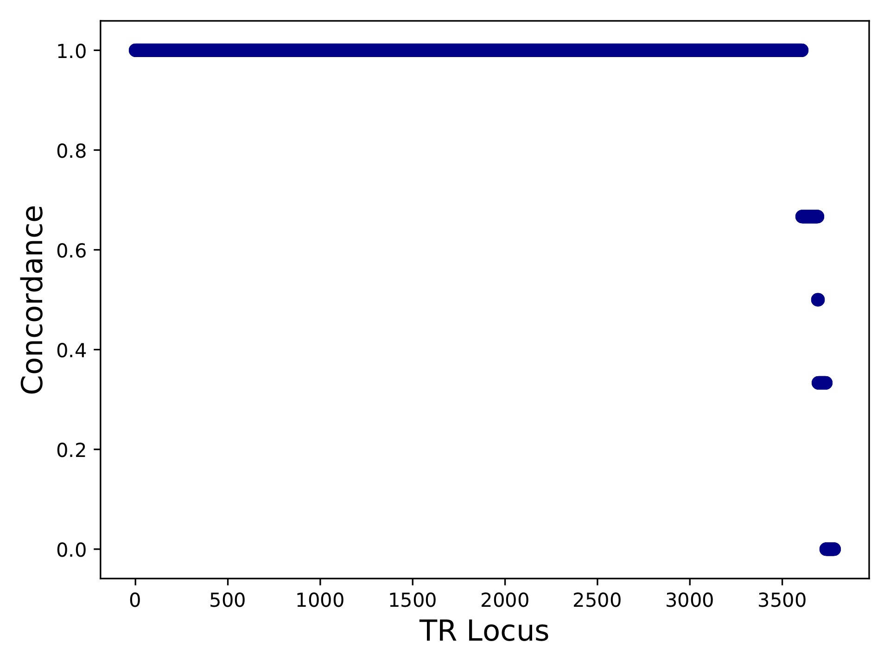

Comparing TR calls across different genotypers
==============================================

Tools used: mergeSTR, compareSTR

This vignette shows how to use :code:`mergeSTR` to merge VCFs from multiple samples into a single VCF, and :code:`compareSTR` to compare VCF files generated by different genotypers (HipSTR and ExpansionHunter) using the same set of reference TRs. In this example, we use VCF files available at https://github.com/gymrek-lab/TRTools/tree/master/example-files:

* :code:`NA12878_chr21_eh.sorted.vcf.gz`, :code:`NA12891_chr21_eh.sorted.vcf.gz`, and :code:`NA12892_chr21_eh.sorted.vcf.gz` generated using ExpansionHunter on three separate samples
* :code:`trio_chr21_hipstr.sorted.vcf.gz` generated using HipSTR run jointly on all three samples.

Both VCFs were generated using the same reference set of TRs to make them comparable. We'll also need the file :code:`hg19.fa.fai` for adding the appropriate header lines to the ExpansionHunter VCF files. (You can generate this file from a reference genome fasta file using :code:`samtools faidx`).

First, we'll want to merge the three samples called separately by ExpansionHunter into a single VCF file using :code:`mergeSTR`. We'll need to do one VCF cleanup using `bcftools reheader` to make sure the appropriate contig lines are present in the VCF file::

  # Add contig lines to the headers
  bcftools reheader -f hg19.fa.fai -o NA12878_chr21_eh.reheader.vcf.gz  NA12878_chr21_eh.sorted.vcf.gz
  bcftools reheader -f hg19.fa.fai -o NA12891_chr21_eh.reheader.vcf.gz  NA12891_chr21_eh.sorted.vcf.gz
  bcftools reheader -f hg19.fa.fai -o NA12892_chr21_eh.reheader.vcf.gz  NA12892_chr21_eh.sorted.vcf.gz
  tabix -p vcf NA12878_chr21_eh.reheader.vcf.gz
  tabix -p vcf NA12891_chr21_eh.reheader.vcf.gz
  tabix -p vcf NA12892_chr21_eh.reheader.vcf.gz

  # Merge all the EH samples to one VCF
  mergeSTR --vcfs NA12878_chr21_eh.reheader.vcf.gz,NA12891_chr21_eh.reheader.vcf.gz,NA12892_chr21_eh.reheader.vcf.gz \
      --out trio_chr21_eh

  # Bgzip and index the output VCF to get ready for compareSTR
  bgzip trio_chr21_eh.vcf
  tabix -p vcf trio_chr21_eh.vcf.gz

Now, we have a file from each tool (:code:`trio_chr21_hipstr.sorted.vcf.gz` and :code:`trio_chr21_eh.vcf.gz`) containing genotypes for all three samples. We can use :code:`compareSTR` to compare these::

  compareSTR --vcf1 trio_chr21_hipstr.sorted.vcf.gz --vcf2 trio_chr21_eh.vcf.gz \
     --vcftype1 hipstr --vcftype2 eh --out hipstr_vs_eh

This command tells :code:`compareSTR` to compare these two VCFs. By specifying :code:`--vcftype1` and :code:`--vcftype2` we are telling it what format the two VCFs are in. Note, TRTools will try to automatically infer this anyway, and make sure what we infer matches what was specified.

This should output several text files:

* :code:`hipstr_vs_eh-overall.tab` will give overall concordance info::

    period    concordance-seq    concordance-len    r2                numcalls
    ALL       0.9533784988411481 0.9741486896059903 0.734005622224775 11218

Since we did not specify the :code:`--period` option, we are considering "ALL" repeat units. This file shows the overall percent of matching calls based on allele sequences (:code:`concordance-seq`) and allele lengths (:code:`concordance-len`), the squared Pearson between genotypes (sum of allele lengths) (:code:`r2`), and the number of calls compared (:code:`numcalls`).

* :code:`hipstr_vs_eh-callcompare.tab` gives a call by call comparison.

* :code:`hipstr_vs_eh-locuscompare.tab` gives per-locus comparison statistics.

* :code:`hipstr_vs_eh-samplecompare.tab` gives per-sample comparison statistics::
    sample   metric-conc-seq    metric-conc-len    numcalls
    NA12891  0.9540475554368154 0.9746192893401016 3743
    NA12878  0.9526864474739375 0.9740711039828923 3741
    NA12892  0.953401178361007  0.9737546866630958 3734

:code:`mergeSTR` will also output several plots to visualize the comparison results:

* :code:`hipstr_vs_eh-samplecompare.pdf`

* :code:`hipstr_vs_eh-locuscompare.pdf`

* :code:`hipstr_vs_eh-bubble-periodALL.pdf`

