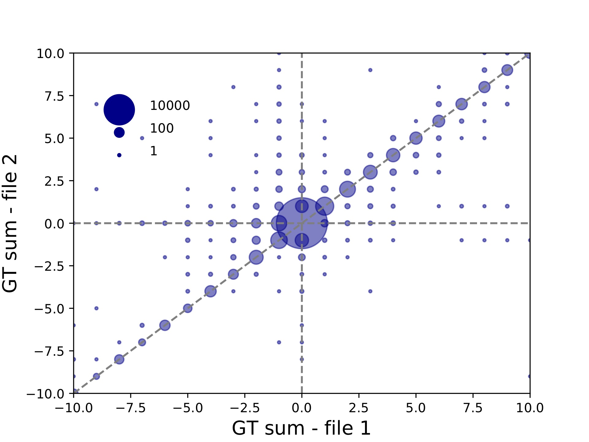

Comparing TR calls across different parameter sets
==================================================

Tools used: compareSTR

This vignette shows how to use :code:`compareSTR` to compare two VCF files generated using the same set of reference TRs. In this example, we use VCF files :code:`c57_ex1.vcf.gz` and :code:`c57_ex2.vcf.gz` available at https://github.com/gymrek-lab/TRTools/tree/master/example-files. These VCF files were generated by GangSTR on a mouse dataset using two different sets of stutter parameters.

To run :code:`compareSTR`::

	compareSTR \
    	--vcf1 c57_ex1.vcf.gz \
    	--vcf2 c57_ex2.vcf.gz \
        --vcftype1 gangstr \
        --vcftype2 gangstr \
        --out c57-compare \
        --stratify-fields DP \
        --stratify-binsizes 0:50:10 \
        --bubble-min -10 --bubble-max 10

Let's go through what each option did:

* :code:`--vcf1` and :code:`--vcf2` give the name of the two VCF files being compared.
* :code:`--vcftype1` and :code:`--vcftype2` give the types of the two VCF files being compared
* :code:`--out` is the required output prefix. 
* :code:`--stratify-fields DP` and :code:`--stratify-binsizes 0:50:10` tell the script to compute overall concordance metrics stratifying by the DP field (coverage) in bins of 10 ranging from 0 to 50. Since we didn't specify which file to apply the stratification to with :code:`--stratify-file`, it gets applied to both.
* :code:`--bubble-min -10 --bubble-max 10` give the axis range of the bubble plot to show (see below).

This will output a number of files. We'll peek at a couple of them. 

* :code:`c57-compare-overall.tab` will give overall concordance info::

	period	DP	concordance-seq	concordance-len	r2	numcalls
	ALL	NA	0.9760415527610716	0.9760415527610716	0.9909303005952199	91450
	ALL	0.0-10.0	1.0	1.0	1.0	266
	ALL	10.0-20.0	0.9426900584795321	0.9426900584795321	0.9995028621738471	855
	ALL	20.0-30.0	0.9285714285714286	0.9285714285714286	0.9950024662641009	1218
	ALL	30.0-40.0	0.9548577036310107	0.9548577036310107	0.9780821396586636	3057
	ALL	40.0-50.0	0.9739065606361829	0.9739065606361829	0.9880478071563313	8048

Here, the first line gives the overall concordance. The lines below are stratified by DP value. For each set, the concordance (percent of calls matching), r2 (Pearson correlation between allele calls), and number of calls in each group is shown.

* :code:`c57-compare-callcompare.tab` gives a call by call comparison, which is useful for looking at exactly which loci/sample calls were discordant.

* :code:`c57-compare-locuscompare.tab` and :code:`c57-compare-samplecompare.tab` give locus and sample level concordance. In this case these are not very interesting since we have only one sample being compared. But in other settings, these files can be used to identify poorly performing samples or loci.

* :code:`c57-compare-bubble-periodALL.pdf` plots the genotypes in file 1 vs. file 2. Genotypes are given in terms of the sum across both alleles of the repeat units different from the reference. Bubble sizes give the number of calls represented by each point. This plot is shown below:

Since we used :code:`--bubble-min -10 --bubble-max 10`, the plot goes only from -10 to +10. This plot can be useful in evaluating the effects of varying different parameters on calling. For example, we can see from this plot that there are quite a few calls that are called longer in file 2 vs. file 1. 

