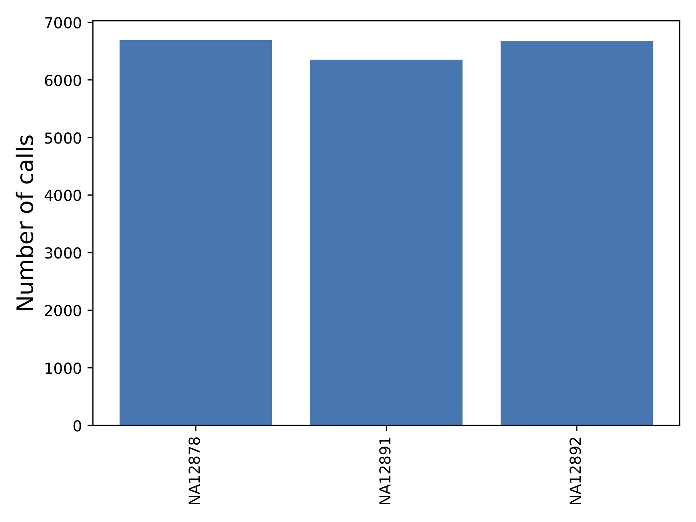
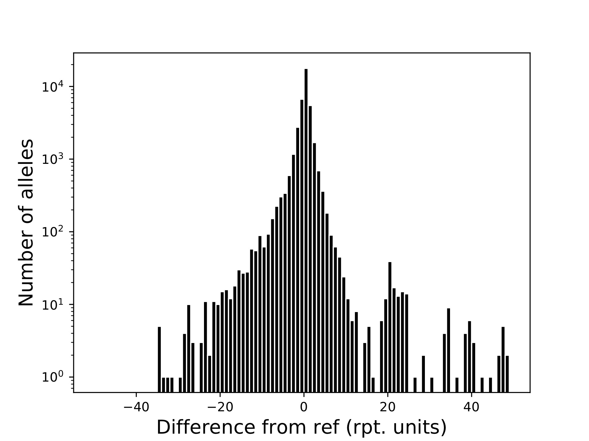
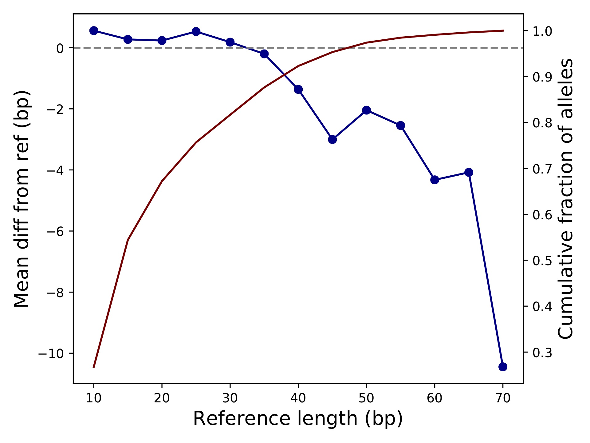

Filtering and QC of VCFs
========================

Tools used: dumpSTR, qcSTR

This vignette shows how to use :code:`dumpSTR` to filter a VCF and :code:`qcSTR` to visualize some basic QC metrics. For this example, we use the file :code:`trio_chr21_popstr.sorted.vcf.gz` available at https://github.com/gymrek-lab/TRTools/tree/master/example-files. This file was generated on samples NA12878, NA12891, and NA12892 using popSTR.

First, let's perform some filtering on the VCF::

  dumpSTR --vcf trio_chr21_popstr.sorted.vcf.gz --popstr-require-support 2 --popstr-min-call-DP 10 \
      --out popstr-filtered --min-locus-callrate 1
  bgzip -f popstr-filtered.vcf
  tabix -p vcf popstr-filtered.vcf.gz

This command filters calls with depth of less than 10 or with alleles supported by less than 2 reads, and loci with any missing genotypes. Now, we can run :code:`qcSTR` on the filtered VCF::

  qcSTR --vcf popstr-filtered.vcf.gz --out popstr-qc

This will output the following files:

* :code:`popstr-qc-sample-callnum.pdf`

This shows the number of calls per sample.

* :code:`popstr-qc-diffref-histogram.pdf`

This shows the distribution of allele sizes relative to the reference genome.

* :code:`popstr-qc-diffref-bias.pdf`

This shows the difference in allele size from the reference as a function of the reference length. We can see as expected calls are biased toward deletions for longer TRs.
