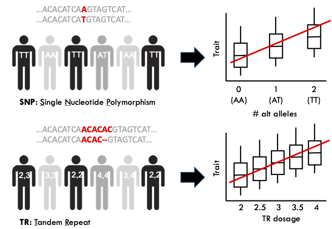

Performing a TR-based GWAS using imputed genotypes
==================================================

Overview
--------

* TRTools tools used: annotaTR
* Other tools used: Beagle, bcftools, plink2

The tutorial walks through the following steps:

* :ref:`Step 1: Imputing TRs from genotype data <step1>`

  * :ref:`Step 1.1: Genotype preprocessing <step1_1>`
  * :ref:`Step 1.2: Imputing TRs in each batch <step1_2>`
  * :ref:`Step 1.3: Extracting TRs from each batch <step1_3>`
  * :ref:`Step 1.4: Merging results from each batch <step1_4>`

* :ref:`Step 2: Computing dosages with annotaTR <step2>`
* :ref:`Step 3: Running GWAS with TR genotypes <step3>`

Background
----------

To run a GWAS, you will need to have genotypes and phenotype data for your phenotype of interest available for a large cohort. Whereas SNP-based GWAS typically tests each variant for linear association between the number of alternate alleles an individual has vs. the phenotype value, the TR-based GWAS below tests for linear association between "TR dosages" and the phenotype at each TR. There are multiple ways to define TR dosage defined below, but all are related to the mean number of copies of the repeat each person has across their two alleles at a particular TR. This overall framework is similar to that described in `Margoliash et al. 2023 <https://pubmed.ncbi.nlm.nih.gov/38116119/>`_.

This tutorial shows how to perform a GWAS using TR genotypes obtained from imputation. Alternatively, genotypes can be obtained directly from WGS data using one of the supported callers_. If you already have quality filtered TR calls available and do not need to perform imputation, you can jump directly to step 2 below.

A WDL workflow performing steps 1 and 2 is available on our `CAST TR imputation workflow <https://github.com/CAST-genomics/cast-workflows/blob/main/tr-imputation/wdl/batch_imputation.wdl>`_ page.

Another note: this is just one way to do a TR-based GWAS! In particular, we rely on finding linear associations between TR length and a trait of interest. Other options include: (1) looking for non-linear associations (e.g. quadratic or threshold effects) or (2) incorporating information about repeat sequence variation, in addition to length, into the association test. These are not covered here since our work on those is still exploratory, but we hope to incorporate those into workflows (and corresponding tutorials) soon.

.. _step1:

Step 1: Imputing TRs from genotype data
---------------------------------------

Imputation overview
~~~~~~~~~~~~~~~~~~~

The steps below assume you will be imputing, rather than directly genotyping, TRs for your cohort. There are multiple scenarios when imputing TRs might be preferred over direct genotyping:

* If you only have genotype data (typically SNPs and indels) available for your GWAS cohort and therefore cannot directly genotype TRs
* Even when WGS data is available, it can be expensive and time-consuming to perform genome-wide TR genotyping. For example, the pipeline below is based on what our group has applied to the `All of Us dataset <https://workbench.researchallofus.org/>`_ which at the time of writing has WGS for around 246,000 individuals. Running HipSTR on a single sample takes around 16 hours/sample, and would cost tens to hundreds of thousands of dollars at this scale. Instead, we can rely on imputation, which can give accurate genotypes at the majority of TRs and is much faster.

The steps below guide you through performing TR imputation on cohorts of up to hundreds of thousands of samples.

Prerequisites
~~~~~~~~~~~~~

You will need the following files and tools to run the imputation step:

* **Individual-level SNP/indel genotypes (VCF format)**. You will need SNP/indel genotypes for your GWAS cohort. These can optionally be phased but that is not required, and if unphased Beagle will phase prior to imputation. Imputation with Beagle will require these to be in VCF format. More on preprocessing genotypes below. 

* **SNP-TR reference panel (VCF or BREF3 format)**. You will need a precomputed referene panel that contains phased SNP and TR genotypes from an orthogonal cohort. The panel needs to be in either VCF or BREF3 format to be compatible with Beagle. We have generated two such panels:

  * `Saini et al. <https://gymreklab.com/2018/03/05/snpstr_imputation.html>`_ This panel is in the GRCh37 reference build and contains 445,725 STRs and 27M SNPs/indels for 2,504 samples from the 1000 Genomes Project. Genotypes had been imputed into 1000 Genomes samples based on calls in the Simons Simplex Collection, which is predominantly European. It is also restricted to STRs called by HipSTR with repeat unit lengths <= 6bp. This panel is available in VCF format with one file/chromosome.
  * `Ziaei-Jam et al. <https://github.com/gymrek-lab/EnsembleTR/blob/fix-ref/README.md#version-iii-of-reference-snptr-haplotype-panel-for-imputation-of-tr-variants>`_ This panel is in the GRCh38 reference build and contains 1,070,698 TRs and 70M Snps/indels from 3,202 samples from the 1000 Genomes Project. TR genotypes are based on `EnsembleTR <https://github.com/gymrek-lab/ensembleTR>_` and contain both STRs (repeat unit 1-6bp) and VNTRs (repeat unit 7+bp). The steps below were specifically tested with this panel but should also be mostly relevant to imputation with the Saini reference panel. This panel is available in VCF and BREF3 formats with one file/chromosome.

* **Genetic map (optional)**. You can optionally provide a genetic map to Beagle with cM coordinates, which are more accurate for modeling recombination than bp coordinates. We used the `GRCh38 map files available from Beagle <https://bochet.gcc.biostat.washington.edu/beagle/genetic_maps/>`_.

* **Tools**

  * `Beagle <https://faculty.washington.edu/browning/beagle/beagle.27May24.118.jar>`_: Beagle is used for imputing TRs from SNPs/indels. The steps below were tested with :code:`beagle.27May24.118.jar` which the link points to.
  * `bcftools <https://samtools.github.io/bcftools/bcftools.html>`_: Bcftools is used for multiple steps including merging files and extracting TRs from the Beagle output.
  * `tabix <https://anaconda.org/bioconda/tabix>`_: Used for indexing VCF files

Imputation steps
~~~~~~~~~~~~~~~~

.. _step1_1:

Step 1.1: Genotype preprocessing
________________________________

The inputs to Step 1.2 below are one VCF file per chromosome per batch of samples.

Beagle requires genotypes of the target samples to be input in VCF format. If your files are in another format (e.g. PGEN or Plink BED) you will need to first convert them to VCF. Further, the SNP-TR reference panel files and map files are split by chromosome, so you will similarly want your input genotype files to be split by chromosome.

Finally, if you have a very large cohort (more than several thousand samples) imputation with Beagle can be very memory intensive. To avoid memory errors, we recommend splitting your genotypes into batches of 1,000 samples each. We have found the :code:`bcftools plugin split` command helpful for creating all the batches at once. An example command is below::

	bcftools plugin split full_vcf_chr1.vcf.gz -G sample_groups.txt -Oz -o .

    	for f in *.vcf.gz; do tabix -p vcf $f; done

In this command:

* :code:`full_vcf_chr21.vcf.gz` is the VCF file with genotypes for the whole cohort on chr21.
* :code:`sample_groups.txt` is a file defining how the samples should be split into batches. An example is below::

	sample1 -       batch1_chr21
	sample2 -       batch1_chr21
	sample3 -       batch1_chr21
	sample4 -       batch2_chr21
	sample5 -       batch2_chr21
	sample6 -       batch2_chr21

The :code:`split` command above will result in files :code:`batch1_chr21.vcf.gz` and :code:`batch2_chr21.vcf.gz`.

Note, the :code:`bcftools plugin split` function may not be available for some version of bcftools. If that is the case, can use following example command to split the files to batch::

	# split samples by ${batch_size}
	bcftools query -l full_vcf_chr${chrom}.vcf.gz |  awk -v chrom=chr${chrom} -v group_size=${batch_size} 'BEGIN {FS=OFS="\t"} {print $1,"batch"int(NR / group_size)+1"_"chrom}' > ${output_dir}/chr${chrom}/batch_files/
	mkdir -p ${output_dir}/chr${chrom}/batch_files/
	# creat batched sample_list files
  	awk -v outdir="${output_dir}/chr${chrom}/batch_files/" 'BEGIN {FS=OFS="\t"} {print $1 > outdir$2".txt"}' ${output_dir}/chr${chrom}/chr${chrom}_sample_list.txt
 	mkdir -p ${output_dir}/chr${chrom}/split_by_samples
	# split vcf by sample batches
  	for batch in ${output_dir}/chr${chrom}/batch_files/*.txt; do
    		batch_name=$(basename ${batch} | cut -d "." -f 1)
    		bcftools view -S ${batch} ${output_dir}/chr${chrom}/chr${chrom}_with_af_filtered_hg38.vcf.gz -Oz -o ${output_dir}/chr${chrom}/split_by_samples/${batch_name}.vcf.gz
  	done

An full workflow for generating these VCF subsets in All of Us is available from our `CAST subset VCF workflow <https://github.com/CAST-genomics/cast-workflows/tree/main/subset_vcf>`_ page. (Note in that workflow given the cohort size, we further broke up the split step by genomic region and then concatenate the results for all the regions from each chromosome in a final step).

.. _step1_2:

Step 1.2: Imputing TRs in each batch
____________________________________

The following example command runs TR imputation on a single batch of samples for a single chromosome::

	java -Xmx25g -jar beagle.jar \
		gt=batch${batch}_chr${chrom} \
		ref=ensembletr_refpanel_v3_chr${chrom}.bref3 \
		ap=true \
		out=batch${batch}_chr${chrom}_imputed \
		map=beagle_chr${chrom}_b38.map
	tabix -p vcf batch${batch}_chr${chrom}_imputed.vcf.gz

Some important note about the above Beagle command:

* We have had success running Beagle on batches of 1000 samples using 25GB of memory. For larger batch sizes you may need to increase the memory.
* For the reference panel (:code:`ref` argument): you can provide either a VCF or BREF3 file. The VCF/BREF3 files for the EnsembleTR panel have equivalent information. In accordance with the Beagle recommendations, we have found the BREF3 files result in improved run times (about 10%).
* The :code:`ap` argument is optional, but is important to include if you want to take imputation uncertainty into account when performing GWAS. This argument tells Beagle to output allele probabilities for each imputed call. Including it does increase the size of the output VCF files.

To run imputation on the full cohort, you will need to run the above command on each of the VCF files generated in step 1.1 (one file per chrom per batch of samples).

.. _step1_3:

Step 1.3: Extracting TRs from each batch
________________________________________

The Beagle output files contain both the original SNP/indel genotypes (which will now be phased) in addition to the phased imputed TR genotypes. In many cases for downstream steps we are just interested in the TR genotypes (e.g. if you already ran GWAS on the SNPs/indels separately). Before the next step you can optionally filter the Beagle VCF files to include just the TRs, which will also make the files way smaller and easier to work with::

	bcftools view -i 'ID~"EnsTR"' batch${batch}_chr${chrom}_imputed.vcf.gz \
		-Oz -o batch${batch}_chr${chrom}_imputed_TRs.vcf.gz
    	tabix -p vcf batch${batch}_chr${chrom}_imputed_TRs.vcf.gz

This command assumes you are using the EnsembleTR reference panel, which has TR IDs of the form :code:`EnsTR:CHROM:POS`. If you are using a reference panel with different IDs for the TRs you'll need to modify the command above.

On the other hand, if you want to process SNPs+TRs together in the GWAS you can skip this step.

.. _step1_4:

Step 1.4: Merging results from each batch
_________________________________________

Before downstream steps we would like to merge the VCFs across all batches to have a single VCF file per chromosome. While TRTools does include the :code:`mergeSTR` tool which can be used for this, we recommend using :code:`bcftools merge` for large cohorts when using imputed TRs. This is because: (1) after imputation with Beagle the set of REF/ALT alleles should be identical across each batch and match the reference panel, so there is not a need to use mergeSTR which specifically deals with managing differences in alleles represented across files and (2) bcftools is much faster. To merge batches::

	bcftools merge batch1_chr${chrom}_imputed_TRs.vcf.gz batch2_chr${chrom}_imputed_TRs.vcf.gz ... -Oz -o merged_${chrom}_TRs.vcf.gz
	tabix -p vcf merged_${chrom}_TRs.vcf.gz

.. _step2:

Step 2: Computing dosages with annotaTR
---------------------------------------

We will perform one more post-processing step on the imputation results to prepare for running GWAS. We will use the :code:`annotaTR` tool included in TRTools to perform the following:

* Add back TR metadata to the VCFs resulting from imputation. Certain required fields (e.g. START, END, PERIOD) that are present in the TR+SNP reference panel get stripped by Beagle and we need to add those back to make the resulting VCF file compatible with other TRTools utilities.
* Compute TR dosages and store them in a PGEN file which can be used directly as input to plink for GWAS in Step 3.

To run :code:`annotaTR` on each VCF::

	annotaTR --vcf merged_${chrom}_TRs.vcf.gz \
            --ref-panel ensembletr_refpanel_v3_chr${chrom}.vcf.gz \
            --update-ref-alt \
            --vcftype hipstr \
            --dosages beagleap_norm
            --out merged_${chrom}_TRs_annotated \
            --outtype pgen vcf \
            --vcf-outtype z

Below we describe what each of these options does:

* :code:`--vcf` provides annotaTR with the unannotated VCF resulting from imputation
* :code:`--ref-panel` provides annotaTR with the reference panel VCF, which is used to add back the required metadata fields
* :code:`--update-ref-alt` tells annotaTR to add back the exact allele sequences from the REF and ALT fields from the reference panel. This is because bcftools merge in some cases trims extra bases from REF and ALT sequences, which can cause problems for downstream processing with TRTools.
* :code:`--vcftype hipstr` tells TRTools this is a hipSTR-style VCF file
* :code:`--dosages beagleap_norm` tells annotaTR to compute dosages that take into account imputation uncertainty based on the Beagle AP field, and normalize dosages to between 0 and 2. Note this option requires that you had set :code:`ap=true` during the Beagle step above.
* :code:`--out` is a prefix to name the output files
* :code:`--outtype pgen vcf` tells annotaTR to output both PGEN and VCF files with the dosage information.
* :code:`--vcf-outtype z` tells it to output the VCF in bgzipped format.

This command will output the following files::

	merged_${chrom}_TRs_annotated.vcf
	merged_${chrom}_TRs_annotated.psam
	merged_${chrom}_TRs_annotated.pgen
	merged_${chrom}_TRs_annotated.pvar

Note: if your TR genotypes are obtained directly from WGS and wihtout imputation, you can leave out the options :code:`--update-ref-alt` and :code:`--ref-panel` and should use :code:`--dosages bestguess_norm` since you will not have the Beagle AP field.

See the `annotaTR documentation page <https://github.com/gymrek-lab/TRTools/tree/master/trtools/annotaTR>`_ for full details for each option.

.. _step3:

Step 3: Running GWAS with TR genotypes
--------------------------------------

Now that we have imputed TRs, we are finally ready to perform GWAS! There are two ways to do this. You can use the VCF file as input to `associaTR <https://trtools.readthedocs.io/en/stable/source/associaTR.html>`_ which is part of TRTools. Alternatively, you can use the PGEN files directly as input to `plink2 <https://www.cog-genomics.org/plink/2.0/>`_. For linear association testing, these tools should give identical results. The advantages of using plink2 over associated are that: (1) plink2 is faster, (2) you have access to a rich set of plink options, including logistic regression, filtering samples, calculating LD, etc. that are not all available in associaTR currently, and (3) you can process SNPs and TRs all in one place. Therefore, our example below performs GWAS using plink2 on the PGEN files::

	plink2 --pfile merged_${chrom}_TRs_annotated \
       --pheno phenotypes.txt \
       --glm hide-covar \
       --covar covars.txt \
       --covar-variance-standardize \
       --out merged_${chrom}_TRs_gwas

Where the options to :code:`--pheno` and :code:`--covar` should be formatted according to the plink documentation.

This should output a file with GWAS summary statistics for each TR tested that can be used for downstream analysis.

.. _callers: https://trtools.readthedocs.io/en/stable/CALLERS.html
