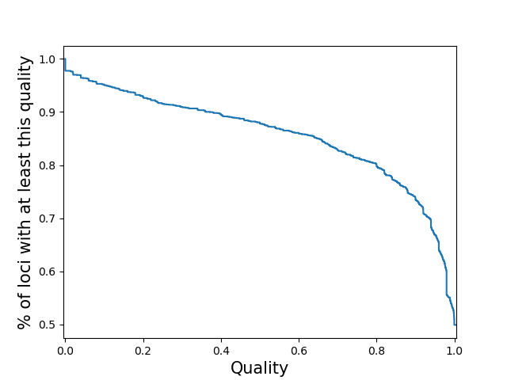
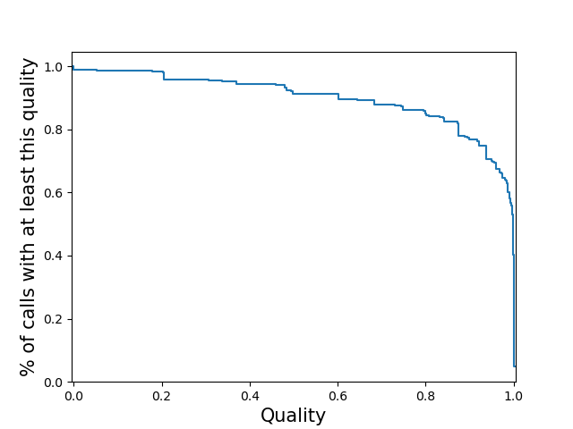

.. overview_directive
.. |qcSTR overview| replace:: qcSTR generates plots that are useful for diagnosing issues in TR calling.
.. overview_directive_done

qcSTR
=====

|qcSTR overview|

Usage
-----
qcSTR takes as input a VCF file and outputs several plots in pdf format. To run qcSTR, use the following command::

    qcSTR \
  	--vcf <file.vcf> \
   	--out <string> \
   	[additional options]

Required Parameters:

* :code:`--vcf <string>`: Input VCF file
* :code:`--out <string>`: Prefix to name output files

General Optional Parameters:

* :code:`--vcftype <string>`: Type of the input VCF file. Causes qcSTR to fail out if the file is any other type of VCF. Default = :code:`auto`. Must be one of: :code:`gangstr`, :code:`advntr`, :code:`hipstr`, :code:`eh`, :code:`popstr`.
* :code:`--samples <string>`: File containing list of samples to include. If not specified, all samples are used.
  Samples in the list that are not included in the input vcf or
  are misspelled are silently ignored.
* :code:`--period <int>`: Restrict to TRs with this motif length. e.g. to restrict to dinucleotide repeats, use :code:`--period 2`.
* :code:`--version`: Show the version number of qcSTR and exit.

If you wish to run qcSTR on a more complicated subset of the input VCF, we suggest you use
:code:`dumpSTR` or `bcftools view <http://samtools.github.io/bcftools/bcftools.html#view>`_ to
filter the input VCF first, and then run qcSTR on the vcf those commands
outputed.

Additional options to customize various plots output by qcSTR are described in the sections `Quality Plot Options`_ and `Reference Bias Plot Options`_ below.

See `Example Commands`_ below for example qcSTR commands for different supported TR genotypers based on example data files in this repository.

Outputs
-------

qcSTR outputs the following plots:

:code:`<outprefix>-sample-callnum.pdf`: a barplot giving the number of calls for each sample. Can be used to determine failed or outlier samples.

:code:`<outprefix>-chrom-callnum.pdf`: a barplot giving the number of calls for each chromosome. Can be useful to determine if the expected number of calls per chromosome are present.

:code:`<outprefix>-diffref-histogram.pdf`: a histogram of, for each allele called, the difference between its length and the length of the reference at that locus (measured in number of repeat units). Can be used to visualize if there is a strong bias toward calling deletions vs. insertions compared to the reference, which might indicate a problem.

.. image:: images/diffref-histogram.png

:code:`<outprefix>-diffref-bias.pdf`: plots reference length (bp) vs. the mean (or median) difference in length of each allele called compared to the reference allele. It is expected that the mean difference should be around 0 for most settings. When this value starts to deviate from 0, e.g. for very long repeats, it could indicate a drop in call quality. The red line gives the cumulative fraction of TRs below each reference length.

:code:`<outprefix>-quality.pdf`: plots the cumulative distribution of the quality scores for
calls in this VCF. This will be a per-locus plot for >5 samples, or a sample-stratified plot
for <= 5 samples. This will not be produced for vcfs which do not have quality
metrics. Alternatively, you may specify the type(s) of quality plot(s) you wish to see with
the :code:`--quality` option. In that case you will get a file named
:code:`<outprefix>-quality-<type>.pdf` for each type of plot you requested. Quality plot
examples are shown below. To learn more about how qcSTR infers quality scores for VCFs from
different genotypers, see `here <https://trtools.readthedocs.io/en/latest/LIBRARY_SPEC.html>`_

Note: quality score plots are useful when considered in the context of a single genotyper run,
and can also be used to compare different invocations of the same genotyper. However,
quality score values produced by different genotypers have different meanings due to the different 
modeling assumptions the different genotypers make. If you wish to compare quality
scores across genotypers, you **must** first understand those different assumptions and infer how 
they will affect the validity of your comparison. 

Quality Plot Options
--------------------

These additional options can be used to customize quality score distribution plots.

:code:`--quality`:  This option determines if the plot is stratified and what
distribution the y-axis represents. The x-axis is always the quality score and the 
y-axis is always a decreasing CDF. This can be specified multiple
times to produce multiple plots (e.g. :code:`--quality per-locus --quality
per-sample`). Each plot will have the specified type appended to the output filename.

* :code:`per-locus`
  Compute the call quality at each locus averaged across all samples.
  Plot the distribution of those loci qualities.

.. produced running qcSTR on many_samples.vcf.gz

* :code:`sample-stratified`
  Plot a separate line for each sample of the distribution of loci qualities
  for that sample.
  Note: If you specify this for a vcf with many samples,
  the code may slow to a halt, run out of memory and/or the plot may be cluttered.

.. produced running qcSTR on test_popstr.vcf
.. image:: images/quality-sample-stratified.png

* :code:`per-sample`
  Compute the call quality for each sample averaged across all loci.
  Plot the distribution of those sample qualities.

.. produced running qcSTR on many_samples.vcf.gz
.. image:: images/quality-per-sample.png

* :code:`locus-stratified`
  Plot a separate line for each locus of the distribution of sample qualities
  at that locus.
  Note: If you specify this for a vcf with many loci,
  the code may slow to a halt, run out of memory and/or the plot may be cluttered.

.. produced running qcSTR on few_loci.vcf
.. image:: images/quality-locus-stratified.png

* :code:`per-call`
  Plot the distribution of the quality of all calls.
  Note: If you specify this for a large vcf the code may run out of memory.

.. produced running qcSTR on test_popstr.vcf

:code:`--quality-ignore-no-call` - by default, (sample, locus) pairs which
were not called are treated as calls with zero quality for the the quality plot.
With this option enabled, instead they are ignored. This may cause the
plotting to crash if it causes some samples/loci to have <= 1 valid call.

Reference Bias Plot Options
---------------------------

These additional options can be used to customize reference bias plots.

* :code:`--refbias-binsize <int>`: Sets the binsize (in bp) used to bin x-axis values, which give the reference TR length. Default=5.
* :code:`--refbias-metric <string>`: Determines which metric to use to summarize the reference bias in each bin. Default=mean.
  Must be one of: :code:`mean` or :code:`median`.
* :code:`--refbias-mingts <int>`: Exclude points computed using fewer than this many genotypes. This option is meant to avoid plotting outlier points driven by bins with small numbers of TRs with that reference length. Default=100.
* :code:`--refbias-xrange-min <int>`: Exclude points corresponding to TRs with reference length less than this value.
* :code:`--refbias-xrange-max <int>`: Exclude points corresponding to TRs with reference length greater than this value.

Example Commands
----------------

Below are :code:`qcSTR` examples using VCFs from supported TR genotypers. Data files can be found at https://github.com/gymrek-lab/TRTools/tree/master/example-files::

  # AdVNTR
  qcSTR --vcf NA12878_chr21_advntr.sorted.vcf.gz --out test_qc_advntr

  # ExpansionHunter
  qcSTR --vcf NA12878_chr21_eh.sorted.vcf.gz --out test_qc_eh

  # GangSTR
  qcSTR --vcf trio_chr21_gangstr.sorted.vcf.gz --out test_qc_gangstr --period 4 --quality per-locus

  # HipSTR
  qcSTR --vcf trio_chr21_hipstr.sorted.vcf.gz --out test_qc_hipstr --vcftype hipstr --samples ex-samples.txt

  # PopSTR
  qcSTR --vcf trio_chr21_popstr.sorted.vcf.gz --out test_qc_popstr

